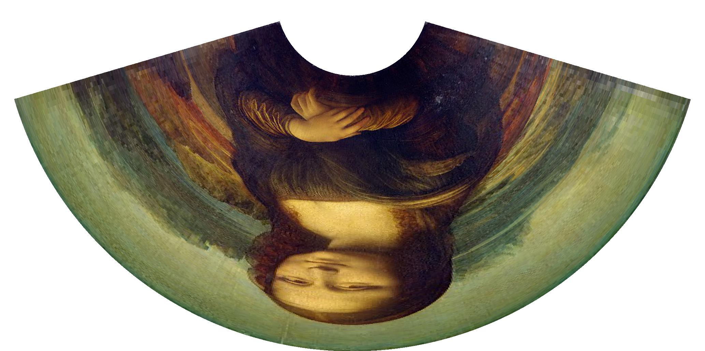

# Anamorpher
Anamorpher is a simple command line tool written in Go used to generate anamorphic images
## Installation
Make sure [Go v1.24.4+](https://go.dev/dl/) is installed then in the anamorpher directory run:
```
go build anamorpher.go
```
## Usage
```
anamorpher [input path] [options]

Options:
  -d
        degrees of elevation for the viewed image
  -o
        output path
  -r
        radius of the cylinder
  -s
        scale to increase the total output image by
  -w
        width of the output image
  -height
        height of the output image
  -i
        use interpolation when generating image
  -il
        the level of interpolation to use

```
## Example
